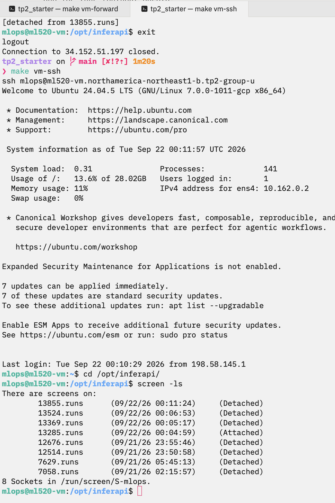
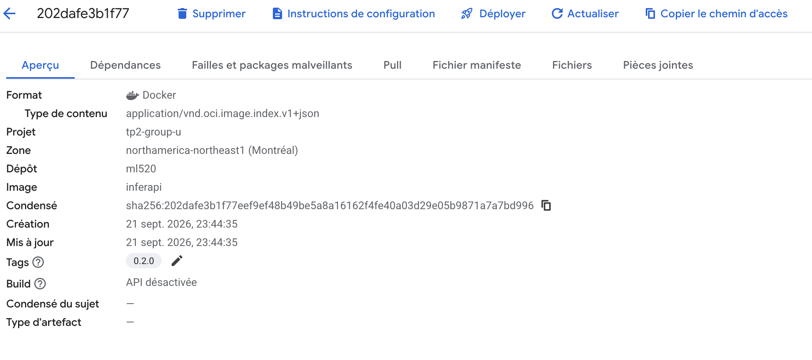

# TP2 - Rapport d'équipe

Équipe : <numéro>
Membres : <noms>

## Question 1 - Deux façons de garder un processus en vie

Les runs ont tourné dans un `screen` et le service tourne sous `systemd`.

Qu'arrive-t-il à `screen` quand la VM redémarre ?

Les runs ont continué à tourner dans screen pendant la coupure SSH, à la reconnexion,j'ai fais `screen -ls` et cela montre toujours `7058.runs (Detached)` et `parallel_runs.log` contient les 9 runs (`exit_code=0` partout).

J'ai fais screen -r 7058 pour reprendre

Qu'arrive-t-il à `systemd` quand la VM redémarre ?

Tant que la machine est éteinte, rien ne tourne (ni screen, ni systemd). Dès que la VM redémarre, systemd est le premier processus lancé, donc il relance automatiquement le service

Dans deploy/inferapi.service nous avons

(Restart=on-failure

[Install]

# This is necessary so that the service starts again after a reboot.

WantedBy=multi-user.target)

Ce qui permet de relancer le service apres un redemarrage

**Preuve** - `screen -ls` après vous être reconnecté en SSH, alors que les runs tournent encore:

## Question 2 - _Docker image and context_

Nommez trois choses que vous avez exclues dans votre .dockerignore et le pourquoi

> Votre réponse ici.

Dans le `Dockerfile`, `uv.lock` est copié **avant** `src/`. Expliquez pourquoi.

> Votre réponse ici.

## Question 3 - L'artefact et les logs

Le modèle est présentement copié dans l'image, donc l'étiquette de l'image nomme une paire code + poids.

Quel est l'avantage à l'exécution, et à partir de quelle taille d'artefact vous choisiriez plutôt de le télécharger au démarrage ?

> Votre réponse ici.

Le conteneur écrit dans ce qu'il voit être `out/logs/app.log`

Où sont allés ces logs: qu'arrive-t-il du fichier quand le conteneur est supprimé ?

> Votre réponse ici.

Qu'est-ce que `docker compose logs` donne à la place en comparaison aux logs écrits dans `out/logs/app.log`.

> Votre réponse ici.

## Question 4 - Compose sur la VM

**Preuve** - votre image dans Artifact Registry, vue depuis la console GCP, avec son étiquette et ses métadonnées:

`loadgen` joint le service par `http://inferapi:8000`, sans qu'aucun port ne soit publié entre les deux.
Qu'est-ce qui résout ce nom, et pourquoi une adresse IP serait un mauvais choix ici ?

> Votre réponse ici.
